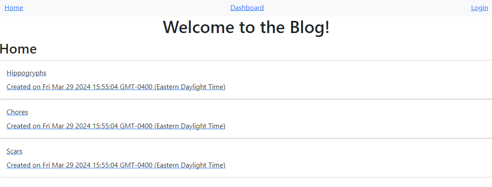

# CMS Style Blog 

  ## Descripton

  This applicaiton is a CMS style blog. It is intended for a user to publish blog posts, and comment on blog posts made by other users.

  ## Table Of Contents
   - [Installation](#installation)
   - [Usage](#usage)
   - [Contributions](#contributions)
   - [Testing](#testing)
   - [Liscense](#liscense)
   - [Questions](#questions)

  ## Installation

  N/A

  ## Usage

  When a user first visits the blog they will see all post made by all users. To interact with the post, the user is required to sign up by clicking "login" found on the navbar. The user will be prompted to provide credintals to their account. Once an account is created and a user is logged in, the will be able to comment on post made by other users and they will be able to access their dashboard. In the dashboard, the user will see any post they have made, the option to update or delete existing post, and the ability to create a new post.

  

  ## Testing

  N/A

  ## Contributions

  N/A

  ## Liscense

  This project uses the [MIT](https://opensource.org/licenses/MIT) liscense

  ## Questions
  Email: [adpileggi@gmail.com](mailto:adpileggi@gmail.com)
  GitHub Profile : [adpileggi](https://github.com/adpileggi)
